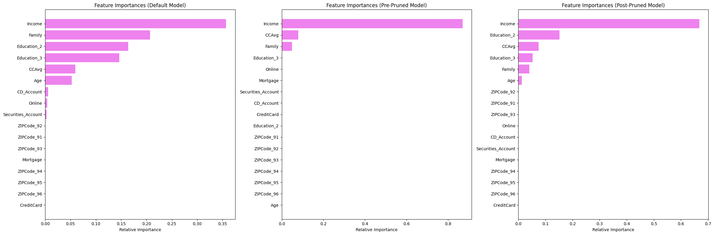
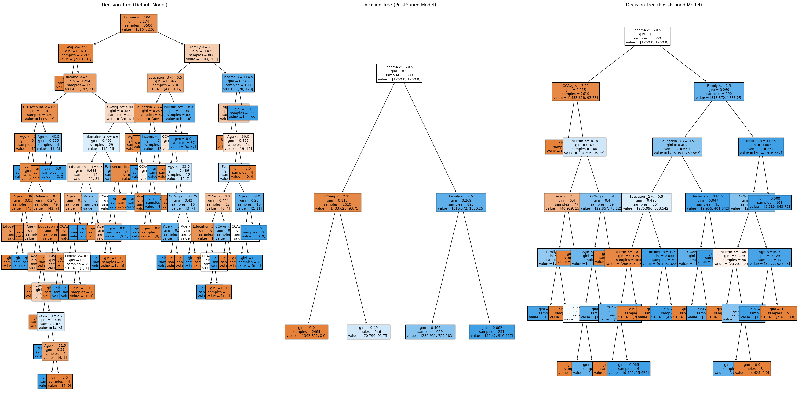

# Project foundation
In ML module of this course, I've gained a good understanding of core machine learning concepts and techniques, which are crucial for this project. The key areas of learning include:

* Supervised Learning: Build and evaluate models like Linear Regression and Decision Trees to predict a specific outcome.

* Unsupervised Learning: Explore K-Means Clustering to discover hidden patterns and group similar data points without predefined labels.

* Model Building Fundamentals: I've also put together a simple, beginner-friendly guide that outlines the key steps to build your first machine learning model.


# Loan Purchase Modelling with Decision Trees



[Analysis Notebook](loan_purchase_modelling_dt.ipynb) <br>

# Problem statement

AllLife Bank aims to expand its base of personal loan customers by converting liability customers (depositors) into borrowers. A previous campaign achieved a conversion rate of over 9%, indicating potential growth opportunities in this area. The current task is to develop a predictive model to identify **customer attributes** that significantly influence loan purchases and to determine **segments of customers** with a higher probability of opting for personal loans. This model will assist in targeted marketing efforts, enhancing the effectiveness of future campaigns.

## Data Dictionary

- **ID**: Customer ID
- **Age**: Customer’s age in completed years
- **Experience**: Number of years of professional experience
- **Income**: Annual income of the customer (in thousand dollars)
- **ZIP Code**: Home Address ZIP code
- **Family**: Family size of the customer
- **CCAvg**: Average spending on credit cards per month (in thousand dollars)
- **Education**: Education Level (1: Undergrad; 2: Graduate; 3: Advanced/Professional)
- **Mortgage**: Value of house mortgage if any (in thousand dollars)
- **Personal_Loan**: Indicator if the customer accepted the personal loan offer in the last campaign
- **Securities_Account**: Indicator if the customer has a securities account with the bank
- **CD_Account**: Indicator if the customer has a certificate of deposit (CD) account with the bank
- **Online**: Indicator if the customer uses internet banking facilities
- **CreditCard**: Indicator if the customer uses a credit card issued by any other bank (excluding AllLife Bank)

## Environment Setup
1. Python virtual environment:

```bash
# Create a virtual environment
python -m venv .venv

# Activate the virtual environment
# On Windows
.venv\Scripts\activate
# On macOS/Linux
source .venv/bin/activate
```

2. Install Required Packages

After activating the virtual environment, install the necessary packages listed in `requirements.txt`:

```bash
pip install -r requirements.txt
```

3. Deactivate the Virtual Environment

To deactivate the virtual environment, simply run:

```bash
deactivate
```